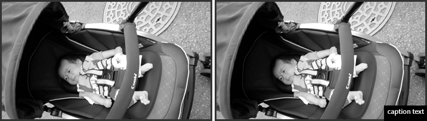

概要
==================
画像タグのalt属性を元にして。
hoverアクションの発生時にキャプションを画像上に表示します。

使い方
==================
下記のように使います。

    $('.imgcaption').imgcaption();

オプションを設定する場合

    $('.imgcaption_op').imgcaption({
      bgcolor:'#fff',
      textcolor:'#000'
    });

This software is released under the MIT License, see LICENSE.txt.